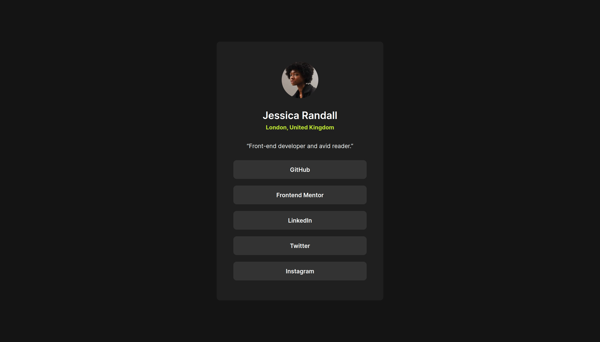

# Social Links Card

This is a Social Links Card component built with HTML & CSS. I try to solve a challenge by using new concepts in CSS to level up my CSS game.

## Table of Contents
- [Overview](#overview)
- [Built With](#built-with)
- [Features](#features)

## Overview

In this project, I have built a responsive social links component using HTML and CSS. The design is fluid and adapts seamlessly to various screen sizes. I have used the BEM (Block, Element, Modifier) naming convention to maintain a clean and scalable CSS code structure.

### Screenshots

#### Desktop View

#### Mobile View

## Built With

- **HTML**: The structure of the web component.
- **CSS**: The styling and layout of the web component using BEM convention.

## Features

- **Responsive Design**: The component is fluid and adapts to various screen sizes.
- **BEM Convention**: The project uses the BEM methodology for better organization of CSS.
- **Cross-Browser Compatibility**: Ensures consistent appearance across different browsers.

---

Thank you for checking out this project! If you have any questions or feedback, feel free to reach out. Happy coding!

